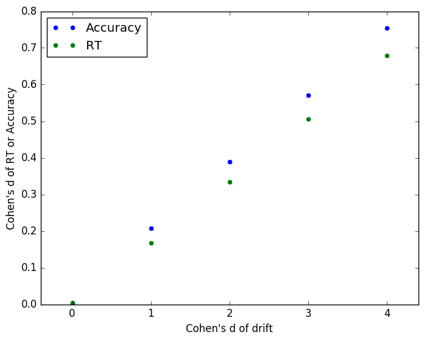
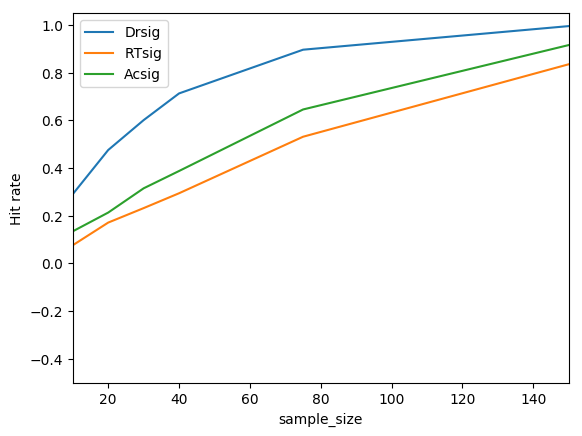
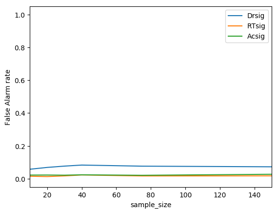
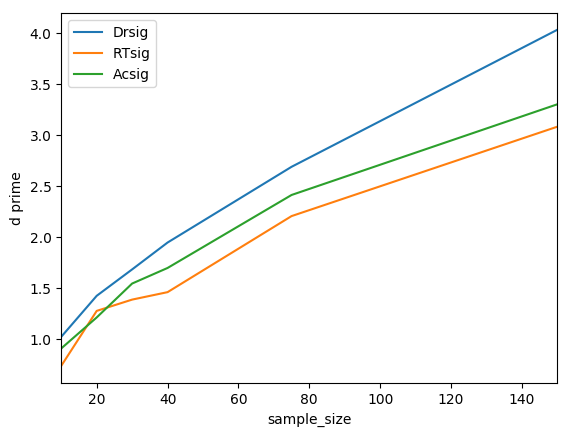
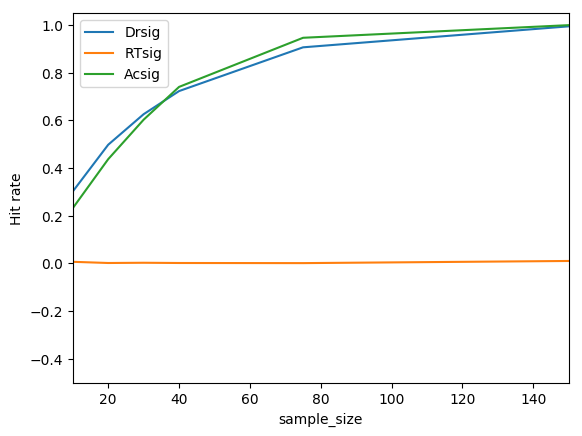
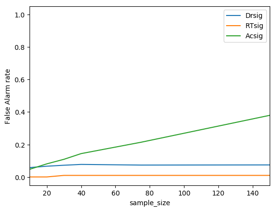
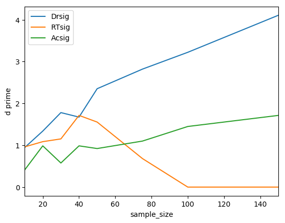

```{r setup,}
library(knitr)
knitr::opts_chunk$set(echo = FALSE, message=FALSE, warning=FALSE, fig.height=2, fig.width=4)
```

# Abbreviations

DDM - Drift diffusion model
SATO - Speed-accuracy trade-off

# Background

## Speed accuracy trade-offs

Use of inefficiency scores is widespread in some domains, e.g. visual search. [@bruyer2011combining]

# Logic of the current investigations


## Goal

To draw the graph of power against sample size, for different levels of true effect size. Power depends on experiment design, as well as sample size and effect size. Currently I am assuming a two group experimental design, and the difference between them gauged with a two-sample t-test (although for drift the HDDM implements a Bayesian test by directly analysing the posteria distributions of the fits for the two groups). Alternatives would be use of Bayesian tests throughout, or also testing different experimental designs (such as a within-participants design). A within-participants design is less preferred because the issue of systemmatically different speed-accuracy trade-offs between condtions seems, *prima facie*, unlikely.

With this analysis done, the outputs are:

* Code for reproducing the analysis <https://github.com/tomstafford/ddm_sims>
* Interactive data visualisation / explorer <https://annakrystalli.shinyapps.io/xspl_power_analyser/>
* Academic paper explaining the above (based on this document)

## Parameter regimes


Because we are not generating an analytic solution we cannot claim that our findings are true for all situations - for all parameterisations of the DDM. Indeed, analytic solutions have already been proposed, and demonstrate the *in theory* superiority of using the DDM over analysing reaction time or accuracy alone [@palmer2005effect;@stone2014using]. Our aim is merely to show that for some reasonable choices of DDM parameters using decision modelling is a superior approach to analysing reaction time or accuracy alone or combining them in any suboptimal way.

To be able to make this claim of relevance of our simulations to typical psychology experiments we need to be able to justify that our parameter choice is plausible for a typical psychology experiment. In order to establish this I have picked parameters which generate reaction times of the order of 1 second and accuracy of the order 90%.

* Note, for high accuracy values t-tests may not be appropriate (they are strictly not applicable to proportions anyway, but this may become a real issue for values very close to 1 or 0).

## Effect sizes

One nuance is that, for our simulations, it is possible to declare the effect size in *drift rate*. To be explicit, this is the *Cohen's d* effect size, defined as the difference between the difference in mean drift rate between the two groups divided by the standard deviation which defines between subject variability in drift rate within the group. These parameters are declared, and the individual drift rates in each similated experiment generated from these parameters. 

For the observed variables, reaction time and accuracy, the effect sizes can only be observed, not declared, since these arise from the interaction of the DDM parameters and the DDM model which generates responses.

So the declared effect size in drift rate produces the observed effect size in reaction time and accuracy (which differ from each other), depending on both the level of noise in each simulated experiment, and the experiment design - specifically on the number of trials per participant.

Experiment designs which have a higher number of trials per participant effectively sample the true drift rates more accurately, and so have effect sizes for reaction time and accuracy which are closer to the 'true', declared, effect size in drift rate.

This issue sheds light on why decision modelling is more effective than analysing reaction time or accuracy alone (because it recovers the generating parameter, drift, which is more sensitive to group differences), and why there are differences in power between measuring reaction time and accuracy (because, presumably, something about the dynamics of the DDM and the parameter regime we test in mean that these variables have different effective effect sizes). See Figure \@ref(fig:effectsizes)


```{r effectsizes, fig.cap="How differences in drift convert to differences in reaction time and accuracy (10 trials per ppt)"}

```


**TODO: Re-run sims with ++ experiments to get RT and Accuracy effect sizes in the same parameter regime as other sims, for 10, 40, 200 trials.**


**TODO: explain why, despite observed effect sizes being, for the most part, comperable, accuracy is more senitive than reaction time**

## Alpha (false positive levels)

Intepreting standard power analysis assumes a standard false positive (*alpha*) rate of 0.05. It would, for example, be nonsensical to talk about two tests having an 80% and 60% probability, respectively, of discovering a true effect if we did not know (and hold constant) the alpha rate (at the limit you can have a power of 100% if your test always reports a significant effect - i.e. an alpha of 1).

For analysing situations where only the drift differs between two groups this is not a signiicant issue. Our tests have an alpha of 0.05 built in to them (and, indeed, when the simulations are run the observed false positive rate does hover around 0.05 as expected).

However, when considering speed-accuracy trade-off changes between groups (with or without drift rate differences as well) the situation is different. This means that it is possible to get false positives in tests of a difference in drifts between groups because of SATOs. Most obviously, if a SATO means one group prioritises speed over accuracy, analysis of reaction time alone will mimic an enhanced drift rate, but analysis of accuracy alone will mimic degraded drift rate. Ideally the DDM will be immune to distortion of estimate of drift rates, but that is what we have set out to demonstrate so we should not assume.

The consequence of this is that it makes sense to move from calculating power for simulated experiments, but to calculate false positive rate as well - i.e. to compare the rate of significant differences with and without true differences in drift. A principled way for combining these into a single metric is d', which gives an overall sensitivity of the test, much as we would calculate the sensitivity independent of bias for an observer in a psychophysics experiment.


# Methods

Ideally we would independently reproduce these results using different DDM implementations.

For the result reported here I use the HDDM [@wiecki2013hddm], running under the Anaconda distribution of Python 3. Code is here <https://github.com/tomstafford/ddm_sims>.

Parallalisation was done by Mike Croucher. It is designed to run via terminal on my local machine or Sharc, the University of Sheffield High Performance Computing cluser. Obviously, where we wish to simulate many thousands of independent experiments there are significant speed gains from parallelisation.

# Results

## Without Speed-Accuracy Trade-offs

We simulate 40 trials per participant, for various group sizes, and true effects between 0 and 16 in *Drift*. This allows us to calculate the false positive rate (when Drift = 0) and the hit rate against sample size for different sizes of true effect (i.e. different differences in drift between groups). The aim is that eventually you will be able to interactively explore the full parameter space here <https://annakrystalli.shinyapps.io/xspl_power_analyser/>

For an idea of the main implications, it is sufficient to plot a slice of the data when the difference in drift is a Cohen's d of 2, Figure \@ref(fig:vanillahits).


```{r vanillahits, fig.cap="Simulated experiment sample size against hit rate (effect size = 2 cohen's d for drift parameter)", fig.align="center", out.width='68%'}

```

When the difference in drifts is a Cohen's d of 0, i.e. no true difference, we get a false positive rate of ~0.05 as we expect, see Figure \@ref(fig:vanillaFAs).

```{r vanillaFAs, fig.cap="Simulated experiment sample size against false positive rate (effect size = 0 cohen'd d for drift parameter)", fig.align="center", out.width='68%'}

```

To correct for variations in rate of false postives we can calculate d' ("d prime"), treating the analysis as if it was a psychophysical observer. This makes little difference if the false positive rate is relatively constant, as in this case, but note the d' of drift at the highest sample size dips due to a rise in the corresponding false positive rate (probably just a random fluctation due to relatively small sample sizes). See Figure \@ref(fig:vanilladprime)


```{r vanilladprime, fig.cap="Simulated experiment sample size against d' (for effect size of 2 vs 0  cohen'd d for drift parameter)", fig.align="center", out.width='68%'}

```
## With SATOs

The superiority of parameter recovery via a decision model becomes even more stark if there are systemmatic speed-accuracy trade-offs. To see this, we re-run the simulatations above, but with a shift in the boundary parameter before group A and group B, such that individuals from group B have a lower boundary, and so tend to make faster but less accurate decisions compared to group B. On top of this difference, we simulate different sizes of superiority of drift rate of group B over group A. 

For the plots below, the drift rate difference is, as above, 0.1 (which, given the interindividual variability translates into an effect size of 2). The boundary parameter difference is also 0.1 / effect size 2.

Unlike when there are no SATOs, the reaction time measure is superior for detecting a group difference than the drift measure, Figure \@ref(fig:SATOhits).

```{r SATOhits, fig.cap="Simulated experiment sample size against hit rate (effect size = 2 cohen's d for drift parameter, 2 for boundary parameter)", fig.align="center", out.width='68%'}

```

This, however, is an artifact of the SATO. If the boundary shift had been in the reverse direction then accuracy, not reaction time, would appear the superior measure. Once we compare the false positive rate the danger of using a single observed measure becomes clear, Figure \@ref(fig:SATOFAs). 

```{r SATOFAs, fig.cap="Simulated experiment sample size against false alarm rate (effect size = 2 cohen's d for drift parameter, 2 for boundary parameter)", fig.align="center", out.width='68%'}

```

When using the drift parameter as a measure the SATO between the groups does not induce false alarms. The accuracy measure is insensitive so also doesn't suffer (but would if the boundary shift was in the opposite direction). The reaction time measure is catastrophically sensitive to false alarms, approaching 100% false alarm rate with larger samples.


Combining the hit rate and the false alarm rate to calculate d', and so see measure sensitivity, Figure \@ref(fig:SATOdprime). 

```{r SATOdprime, fig.cap="Simulated experiment sample size against d' (effect size = 2 cohen's d for drift parameter, 2 for boundary parameter)", fig.align="center", out.width='68%'}

```

# Discussion


Main conclusions

 * Accuracy better than RT (but why?)

 * Significant gains for parameter recovery via DDM (e.g. for 80% power, participants required per group are ~60 for drift, ~100 for accuracy, ~150 for RT).

 * Signfiicant protection against false positives in the case of between groups SATO


Results hold only for the (plausible) parameter regime choosen (ie they are not analytically proved, only numerically demonstrated)


Something about agnosticism between different variations of the the DDM (ref for this = ?)

DDM variants critised as unfalsifiable [@jones2014unfalsifiability]

Blind team analysis project found large diversity of fitting methods, but common inferences [@dutilh2016quality]. Concluded that simpler models should be preferred unless more complex justified. 
[@ratcliff2015individual] claims that heirarchival bayesian methods of fitting are best, at least for individual difference investigations

Cite Veronika Lerche's work


**TODO:**

 * Replicate using another decision model (LBA? DMAT?)
 * Add literature on SATOs etc


# References


