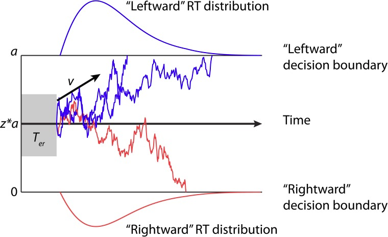
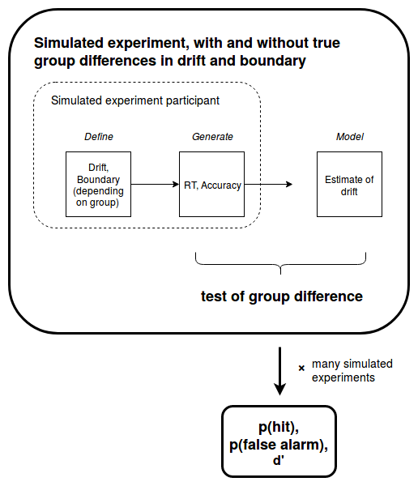
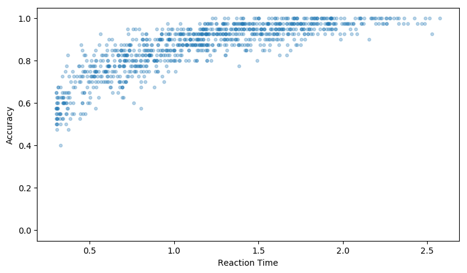
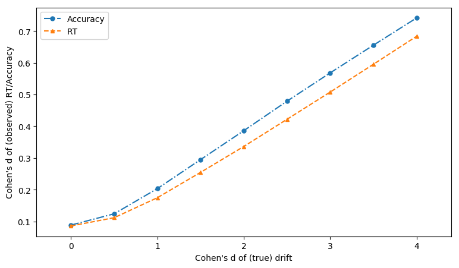
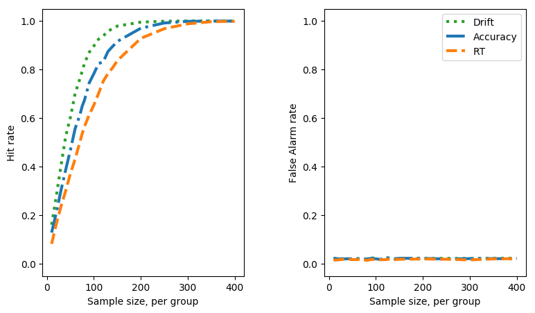
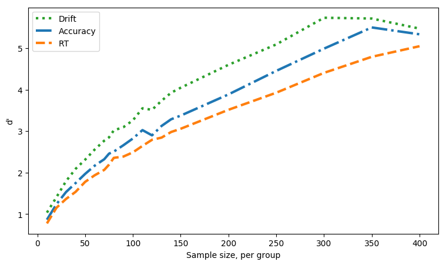
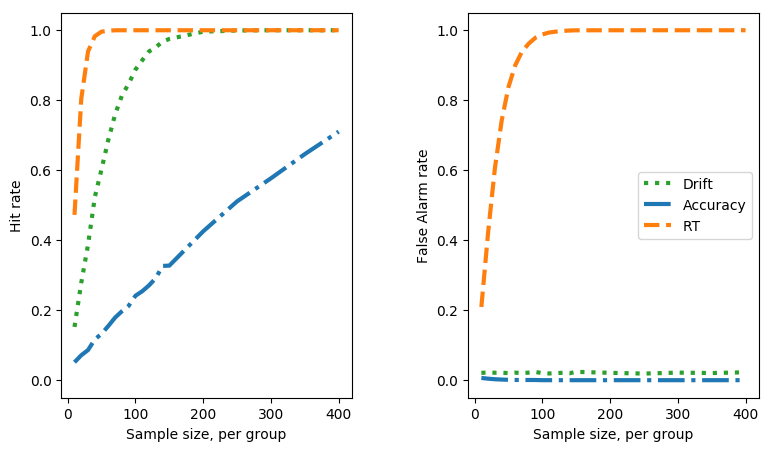
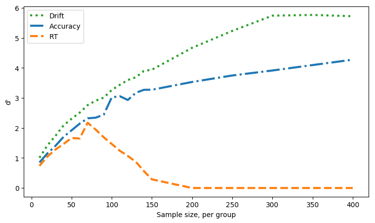

```{r setup,}
library(knitr)
knitr::opts_chunk$set(echo = FALSE, message=FALSE, warning=FALSE, fig.height=2, fig.width=4)
```

`r figsize<-'68%'`

# Abbreviations

DDM - Drift diffusion model

SATO - Speed-accuracy trade-off

# Introduction

## Speed accuracy trade-offs

Speed and accuracy of responding are fundamental measures of performance, collected by behavioural scientists across diverse domains. The two measures are related by the speed-accuracy trade-off (SATO). For reviews of this topic see @wickelgren1977speed; @heitz2014speed. 

The SATO is inextricably linked to the nature of decision making --- it arises whenever we wish to respond as fast and as accurately possible based on uncertain incoming information. More accurate responses require more information, which takes longer to accumulate; faster responses forgo collecting additional information at the cost of higher error rates. Importantly, because the SATO in unavoidable it is also necessary that all decision-making processes are positioned with respect to the trade-off. This does not need to be done deliberately or explicitly, but any decision process can be characterised as adopting some trade-off between speed and accuracy. For the tasks studied by psychologists, it is important to recognise that there will be individual differences, as well as task and group-related differences, in how participants position themselves on the SATO.

Outside of researched focused on SATOs explicitly, different practices have been adopted to account for SATOs or potential SATOs in behavioural data. One approach is to ignore either speed or accuracy. For example, ignoring speed of response is common in psychophysics, whereas some domains of cognitive psychology where high-accuracy is assumed, focus only on response times [e.g. @stafford2011pieron][^p], sometimes after a cursory check of error-rate data, or the failure of standard null-hypothesis test to reveal significant differences in error-rates. Another approach is to combine speed and accuracy. For example, in the domain of visual search it is common to calculate `efficiency' scores by dividing search time by search accuracy as a proportion [e.g. @yates_stafford_2018]. Despite being widespread, there is evidence that this practice is unlikely to add clarity to analysis [@bruyer2011combining].  We also note that the researchers who initially formulated the efficiency score explicitly counselled *against* using it in the case of SATOs [@townsend1983stochastic].

[^p]: Note that we choose to cite work by the lead author here for illustration, rather than highlight any other researchers for their use of these suboptimal practices.

The efficiency score shares with other recent suggestions for accounting for SATOs [@davidson2013modeling;@seli2013enhancing] the property that it assumes a linear relation between response time and accuracy. While such approaches may be better than focusing on a single behavioural variable, the assumption of linearity is at odds with work which has explicitly characterised the SATO [@fitts1966cognitive; @wickelgren1977speed; @heitz2014speed] and has shown distinct a distinctly curvilinear relation between response time and accuracy. As such, although linear correction methods may work for some portions of the SATO, they are likely to be misleading, or at least fail to add clarity, where accuracy and/or speed approaches upper or lower limits of those variables.


## Context

The unprincipled combination of speed and accuracy measures becomes an urgent issue when considered in the  context of widespread questions surrounding the reliability of the literature in psychology. Established results fail to replicate, or replicate with substantially reduced effect sizes [@open2015estimating;@pashler2012editors].

Low statistical power has been a persistent problem across many areas of psychology and cognitive neuroscience [@button2013power; @szucs2017empirical; @stanleymeta; @maxwell2004persistence; @sedlmeier1989studies; @lovakov_agadullina_2017], including, but not limited to, research areas which are bound by costly methods or hard-to-reach populations [@geuter2018effect; @bezeau2001statistical; @cohen1962statistical]. This, combined with factors such as analytic flexibility [@simmons2011false; @silberzahn2017many] --- which can only be increased by a lack of recognition of any optimal analysis method --- has led to a widespread lack of faith in many published results [@ioannidis2005most].

Statistical power is defined with respect to the variability and availability of data, as well as the analysis proposed. For a set experimental design, an obvious candidate for increasing statistical power is to increase sample size, but this is not always easy. Each additional participant costs additional time, money and resources. This is especially true in the case of expensive methods, such as fMRI, or special populations which may be hard to recruit. More sensitive measures also increase statistical power: lower measurement error will tend to reduce variability so that the same mean differences produce larger observed effect sizes.

A motivation for the present work is to demonstrate the practical utility, in terms of increased statistical power, of combining speed and accuracy information in a principled manner. Such an innovation has the appeal of making the most of data which is normally collected, even if not analysed, whilst not requiring more participants (which is costly), or more trials per participant (which also has costs in terms of participant fatigue which may be especially high for some populations, e.g. children).

## Decision modelling

Models of the decision making process provide the foundation for the principled combination of speed and accuracy data, and thus afford experimenters access to considerable statistical power gains. 

Many models exist in which decision making is represented by the accumulation of sensory evidence over time. When the accumulated evidence surpasses some threshold (also called a boundary) then a decision is triggered. The accuracy of the decision depends on which accumulator crosses which boundary, the speed is given by time this takes, and thus such models can be used to fit speed and accuracy data within the same framework. 

A prominent instance of such accumulator models is the so called drift-diffusion model developed by Roger Ratcliff [DDM @ratcliff1978theory; @ratcliff1998modeling]. After a long and successful period of development and application on purely behavioural data, the DDM model was at the centre of an important theoretical confluence. Neurophysiologists found evidence for accumulation like processes in neurons critical to sensory decision making [@smith2004psychology; @gold2001neural], whilst theoreticians recognised that accumulator models could be related to statistical methods of uncertain information integration [@bogacz2006physics; @gold2002banburismus]. Under certain parameterisations many different decision models, all in the family of accumulator models, can be shown to be equivalent to the DDM, and this in turn equivalent to a statistical method which is optimal for making the fastest decision with a given error rate (or the most accurate decision within a fixed time).

While debate continues around the exact specification of the decision model which best reflects human decision making, there is a consensus that the DDM captures many essential features of decision processesing (but see @pirrone2014natural; @teodorescu2016absolutely; @pirrone2018evidence). As you would expect, the DDM has also shown considerable success modelling decision data across many different domains [@ratcliff2008diffusion]. In the sense that the DDM implements a statistically optimal algorithm for accumulation for uncertain information, we would expect our neural machinery to implement the same algorithm in the absence of other constraints [@pirrone2014natural]. The basic mechanism of the DDM is illustrated in Figure \@ref(fig:ddm).

```{r ddm, fig.cap="An illustration of the drift-diffusion model (DDM); taken from Zhang and Rowe, 2014. Here a decision between two choices, `leftward' and `rightward' is shown. Parameters labelled are $v$, the drift rate which reflects the rate of evidence accumulation; $\\alpha$, the boundary seperation, which reflect response conservativeness; $z$, the starting point, which biases the response based on pre-stimulus expectations and $T_{er}$, non-decision time, a fixed delay which does not vary with stimulus information.", fig.align="center", out.width="60%"}

```

For our purposes, the value of these decision models is that they provide a principled reconciliation of speed and accuracy data. Within this framework these observed behavioural measures reflect the hidden parameters of the decision model, most important of which (for our purposes) are the drift rate and boundary separation, which reflect the strength of evidence accumulation (reflecting participant sensitivity/stimulus salience) and the decision boundary (reflecting the conservativeness of the participant's decision criterion; higher boundaries produce slower but more accurate responses).

By fitting the DDM we can deconfound the observed behavioural variables --- speed and accuracy --- and recover the putative generating parameters of the decision --- drift and boundary separation. In principle, this allows a more sensitive measure of participant capability (reflected in the drift parameter). Drift is a more sensitive measure because a) it is estimated using both speed *and* accuracy and b) it is isolated from the effect of different participant response thresholds (which are reflected in the boundary parameter).

Previous authors have established the in-principle gains of this approach. Within a psychophysics framework, @stone2014using extended @palmer2005effect's decision model to show that response time and accuracy contain different, but possibly overlapping, components of Shannon information about the perceived stimulus. If these components do not overlap (as suggested by Stone, in preparation) then combining response time and accuracy data should provide better estimates of key parameters which govern the decision process than relying on either response time or accuracy alone. Previous authors have shown for specific paradigms and decisions that using decision models confers benefits beyond relying on speed, accuracy or some sub-optimal combination of the two, especially in the case of speed-accuracy trade-offs [e.g. @zhang2014dissociable; @park2015approximate]. Our purpose here is not to make a theoretical innovation in decision modelling, but to use established decision models to demonstrate and quantify the benefits of decision modelling for experimentalists.


# Method

The broad approach is to consider a simple standard experimental design: a between groups comparison each group contains a number of participants who complete a number of decision trials, which provide both response time and accuracy data. We simulate data for true and null differences in drift (sensitivity) between the groups, as well as true and null differences in boundary (SATO) between the groups. By varying the number of simulated participants we generate a fixed number of `scenarios' defined by true/null effects in sensitivity, true/null SATOs and experimental sample size. For each scenario we inspect the behavioural measures to see how sensitive and specific they are to detecting true group differences. We also fit the DDM and estimate the participant drift parameters, similarly asking how sensitive and specific estimates of drift are to true group differences in drift. An overview of the method is provided in Figure \@ref(fig:DDMprocess).

```{r DDMprocess, fig.cap="Overview of method", fig.align="center", out.width="75%"}

```

## Decision modelling

To generate simulated response data, and we use the Hierarchical Drift Diffusion Model [HDDM, @wiecki2013hddm]. This toolbox can also perform model fitting, which uses Bayesian estimation methods to simultaneously fit individual decision parameters and the group distributions from which they are drawn. 

While the HDDM offers a principled and comprehensive model fitting approach, it is computationally expensive. An alternative model fitting method, the EZ-DDM [@wagenmakers2007ez] offers a simple approximation, fitting a decision model with a smaller number of parameters using an analytic method which is computationally cheap. Furthermore, the EZ-DDM has been shown to match the full DDM for a range of situations [@van2017ez].

For the model fitting presented here (Figures \ref(fig:vanilla) - \ref(fig:SATOdprime)), we use the EZ-DDM, although we have verified that the results are qualitatively similar using the HDDM and the fast-ddm [@voss2007fast], a third model fitting framework, so we believe that these results do not depend on the particular decision model deployed from the broad class of accumulator models. 

Obviously, where we wish to simulate many thousands of independent experiments there are significant speed gains from parallelisation. Parallalisation was done by Mike Croucher, and the code run on University of Sheffield High Performance Computing cluster. A sense of the value of parallelisation can be had by noting the the data shown in, for example, Figure \ref(fig:SATOdprime) would have taken around 1 calendar month to generate on a single high performance machine, even though they use the computationally `cheap' EZ-DDM method. Python code for running the simulations, as well as the output data, figures and manuscript preparation files, is here <https://github.com/tomstafford/ddm_sims>.

---
#Should be zenado link With DOI https://zenodo.org/
---


## Analysis

Because we are not generating an analytic solution we cannot claim that our findings are true for all situations. Our aim is merely to show that for some reasonable choices of DDM parameters using decision modelling is a superior approach to analysing response time or accuracy alone or combining them in any suboptimal way.

To be able to make this claim of relevance of our simulations to typical psychology experiments we need to be able to justify that our parameter choice is plausible for a typical psychology experiment. In order to establish this we pick parameters which generate response times of the order of 1 second and accuracy of the order 90%.[^p2]. Each participant contributes 40 decision (40 trials) to each experiment. Parameters for drift and boundary separation are defined for the group and individual participant values for these parameters are drawn from the group parameters with some level of variability (and, in the case of true effects, a mean difference between the group values). 

To illustrate this, we show in Figure \@ref(fig:SATOdirect) a direct visualation of the speed-accuracy trade-off, by taking the base parameters we use in our simulated experiments and generating a single participant's average response time and accuracy, using 1000 different boundary separation values. This shows the effect of varying boundary separation alone, while all other decision parameters are stable. 

```{r SATOdirect, fig.cap="Directly visualising the speed-accuracy trade-off: average response time and accuracy from a single simulated particpant with all decision parameters kept fixed except for boundary seperation, which is drawn from a normal distibution (mean = 2, variance = 1) (1000 simulated experiments, each of 40 trials"}

```

[^p2]: Note, for high accuracy values t-tests may not be appropriate (they are strictly not applicable to proportions anyway, but this may become a real issue for values very close to 1 or 0).

For each scenario we simulate a large number of experiments, with participant parameters sampled each time from the defined distributions. For each experiment, any difference between groups is gauged with a standard two-sample t-test for the behavioural variables.

<!-- For the drift rates HDDM implements a Bayesian test by directly analysing the posteria distributions of the fits for the two groups.  -->

### Effect sizes

The drift and boundary parameters for each each simulated participant are drawn from declared group means, meaning that the true difference between groups can be expressed in terms of Cohen's d effect size --- the mean difference between the groups standardised by the within group variability.

For the observed variables, response time and accuracy, the effect sizes can only be observed, not declared, since these arise from the interaction of the DDM parameters and the DDM model which generates responses. The declared group difference in drift rate produces the observed effect size in response time and accuracy (which differ from each other), depending on both the level of noise in each simulated experiment, and the experiment design - specifically on the number of trials per participant.

Experiment designs which have a higher number of trials per participant effectively sample the true drift rate more accurately, and so have effect sizes for response time and accuracy which are closer to the 'true', declared, effect size in drift rate.

This issue sheds light on why decision modelling is more effective than analysing response time or accuracy alone (because it recovers the generating parameter, drift, which is more sensitive to group differences), and why there are differences in power between measuring response time and accuracy (because these variables show different observed effect sizes when generated by the same true different in drift rates). Figure \@ref(fig:effectsizes) shows how declared differences in drift translate into observed effect sizes for response time and accuracy.

```{r effectsizes, fig.cap="How differences in drift convert to observed differences in response time and accuracy (40 trials per ppt)", fig.align="center", out.width=figsize}

```

### Hits (power) and False Alarms (Alpha)

Statistical power is the probability of your measure reporting a group difference when there is a true group difference, analogous to the 'hit rate' in a signal detection paradigm. Conventional power analysis assumes a standard false positive (*alpha*) rate of 0.05. For our simulations we can measure the actual false alarm rate, rather than assume it remains at the intended 0.05 rate.

For analysing situations where only the drift differs between two groups we would not expect any significant variations in false alarm rate. However, when considering speed-accuracy trade-off changes between groups (with or without drift rate differences as well) the situation is different. This means that it is possible to get false positives in tests of a difference in drifts between groups because of SATOs. Most obviously, if a SATO means one group prioritises speed over accuracy, analysis of response time alone will mimic an enhanced drift rate, but analysis of accuracy alone will mimic degraded drift rate. Ideally the DDM will be immune to any distortion of estimates of drift rates, but that is what we have set out to demonstrate so we should not assume.

The consequence of this is that it makes sense to move calculating measure sensitivity, accounting for both the false alarm rate, as well as the hit rate. A principled way for combining false alarm and hit rate into a single metric is d' ("d prime"), which gives an overall sensitivity of the test, much as we would calculate the sensitivity independent of bias for an observer in a psychophysics experiment [@green1966signal]


# Results

The results shown here support our central claim that decision modelling can have substantial benefits. To explore the interaction of power, sample size, effect size and measure sensitivity we have prepared an interactive visualisation which can be found here <https://sheffield-university.shinyapps.io/decision_power/> 

## Without Speed-Accuracy Trade-offs

For an idea of the main implications, it is sufficient to plot a slice of the data when the difference in drift is a Cohen's d of 2. Recall, from Figure \@ref(fig:effectsizes) above, that although this is a large difference in terms of the generating parameter, drift, this translates into small observed effect sizes in accuracy and response time. 

Figure \@ref(fig:vanilla), right, shows how sample size and hit rate interact for the different measures. The results will be depressingly familiar to any experimentalist who has taken power analysis seriously --- a sample size far larger than that conventionally recruited is required to reach adequate power levels for small/medium group differences.

```{r vanilla, fig.cap="Simulated experiment sample size against hit rate and false alarm rate (for effect size of 2 vs 0, cohen'd d for drift parameter)", fig.align="center", out.width='68%'}

```


<!-- # ```{r vanillahits, fig.cap="Simulated experiment sample size against hit rate (effect size = 2 cohen's d for drift parameter)", fig.align="center", out.width='68%'} -->
<!-- # knitr::include_graphics("figs/NOSATO_HitRate.png") -->
<!-- # ``` -->

<!-- # Issue with knitr::include_graphics -->
<!-- # https://sebastiansauer.github.io/two-plots-rmd/ -->


From this figure we can read off the number of participants per group required to reach the conventional 80% power level (equivalent to hit rate of 0.8, if we assume a constant false positive rate). For this part of the parameter space, for this size of difference between groups in drift, and no speed-accuracy trade-off, ~140 participants are required to achieve 80% power if the difference between groups is tested on the speed of correct responses only. If the difference between groups is tested on the accuracy rate only then ~115 participants per group are required. If speed and accuracy are combined using decision modelling, and difference between groups tests on the recovered drift parameters then we estimate that ~55 participants per group are required for 80% power. An experimentalist who might have otherwise had to recruit 280 (or 230) participants could therefore save herself (and her participants) significant trouble, effort and cost by deploying decision modelling, recruiting half that sample size and still enjoying an increase in statistical power to detect group differences.

Figure \@ref(fig:vanilla), left, shows the false alarm rate. When the difference in drifts is a Cohen's d of 0, i.e. no true difference, the t-tests on response time and accuracy both generate false alarm rates at around the standard alpha level of $0.05$

<!-- ```{r vanillaFAs, fig.cap="Simulated experiment sample size against false positive rate (effect size = 0 cohen'd d for drift parameter)", fig.align="center", out.width='68%'} -->
<!-- knitr::include_graphics("figs/NOSATO_FalseAlarms.png") -->
<!-- ``` -->

Figure \@ref(fig:vanilladprime) shows the measure sensitivity, d' for each sample size. In effect, this reflects the hit rate (Figure \@ref(fig:vanillahits)) corrected for fluctuations in false alarm rate (Figure \@ref(fig:vanillaFAs)). This correction will be more important when their are systematic variations in false positive rate due to SATOs

```{r vanilladprime, fig.cap="Simulated experiment sample size against d' (for effect size of 2 vs 0  cohen'd d for drift parameter)", fig.align="center", out.width='68%'}

```
## With SATOs

The superiority of parameter recovery via a decision model becomes even more stark if there are systematic speed-accuracy trade-offs. To see this, we re-run the simulations above, but with a shift in the boundary parameter before group A and group B, such that individuals from group B have a lower boundary, and so tend to make faster but less accurate decisions compared to group B. On top of this difference, we simulate different sizes of superiority of drift rate of group B over group A. 

For the plots below, the drift rate difference is, as above, 0.1 (which, given the inter-individual variability translates into an effect size of 2). The boundary parameter difference is also 0.1, a between group effect size 2.

Unlike when there are no SATOs, the response time measure is superior for detecting a group difference than the drift measure, Figure \@ref(fig:SATO), right.

<!-- # ```{r SATOhits, fig.cap="Simulated experiment sample size against hit rate (effect size = 2 cohen's d for drift parameter, 2 for boundary parameter)", fig.align="center", out.width='68%'} -->
<!-- # knitr::include_graphics("figs/SATO_HitRate.png") -->
<!-- # ``` -->

```{r SATO, fig.cap="Simulated experiment sample size against hit rate and false alarm rate (for effect size of 2 vs 0, cohen'd d for drift parameter, and boundary parameter shifted 0.1 between groups)", fig.align="center", out.width='68%'}

```


This, however, is an artifact of the SATO. If the boundary shift had been in the reverse direction then accuracy, not response time, would appear the superior measure. Once we compare the false positive rate the danger of using a single observed measure becomes clear, Figure \@ref(fig:SATO), left. 

<!-- ```{r SATOFAs, fig.cap="Simulated experiment sample size against false alarm rate (effect size = 2 cohen's d for drift parameter, 2 for boundary parameter)", fig.align="center", out.width='68%'} -->
<!-- knitr::include_graphics("figs/SATO_FalseAlarms.png") -->
<!-- ``` -->

When using the drift parameter as a measure the SATO between the groups does not induce false alarms. The accuracy measure is insensitive so also doesn't suffer (but would if the boundary shift was in the opposite direction). The response time measure is catastrophically sensitive to false alarms, approaching 100% false alarm rate with larger samples.


Combining the hit rate and the false alarm rate to calculate d', and so see measure sensitivity, Figure \@ref(fig:SATOdprime). 

```{r SATOdprime, fig.cap="Simulated experiment sample size against d' (effect size = 2 cohen's d for drift parameter, 2 for boundary parameter)", fig.align="center", out.width='68%'}

```

# Discussion

## Main conclusions

We have shown the benefits of fitting response time and accuracy data with standard decision models. Such decision models allow the estimation of the generating parameters of simple perceptual decisions, such that the participants sensitivity and response conservativeness are deconfounded. This allows more powerful tests of between group differences. In the presence of systematic shifts in the speed-accuracy trade-off, this approach offers protection against false-positives or false-negatives (in the case that SATOs disguise true differences in sensitivity). We do not claim to make theoretical innovation in decision modelling --- the work deploys widely used decision models `off the shelf' and seeks to quantify the extent of the benefit for experimentalists of deploying decision modelling on their behavioural data. The extent of the statistical power gain is considerable. The exact benefit will vary according to the phenomenon and populations investigated, as well as experimental design. For the example design and parameter regime we showcase here the use of decision modelling allows total sample size to be halved while still increasing statistical power. To explore the relation of sample size and effect size to the sensitivity of behavioural measures, and the decision modelling measures, we provide an interactive data explorer here <https://sheffield-university.shinyapps.io/decision_power/> 

## Qualifications

The results we showcase here and in the data explore hold only for the parameter regime chosen. We have not analytically proved that parameter recovery with the DDM will always provide a statistical power gain. We have chosen a simple experimental design, with a plausible trial numbers per participant and decision parameters which generate realistic values for speed and accuracy of responses, but it is possible that for smaller effects, at the boundaries of maximum or minimum speed or accuracy, and/or with higher within and between participant noise, that decision modelling may not have the benefits depicted here.

We have choose not to explore a within-participants design because the issue of systematically different speed-accuracy trade-offs between conditions seems, *prima facie*, less likely. For between groups designs we know of several prominent cases where systematic SATOs confounded conclusions. For example @pirrone2017understanding found that an apparent impairment of perceptual judgement among Autism Spectrum Disorder (ASD) participants could be attributed to a difference in their SATO. The ASD group responded more conservatively, but decision modelling showed their had equivalent sensitivity to the non-ASD group. @ratcliff2006aging found an analogous result for young vs old participants on perceptual discrimination and recognition memory tasks.

As well as occupying a particular point in the parameter space of decision models, our results are also generated using a particular model and model fitting approach [the EZ-DDM, @wagenmakers2007ez], although we have verified that the same qualitative pattern can be produced by alternative approaches [@wiecki2013hddm,@voss2007fast]. Additionally, it is worth noting that for some parameterisations several prominent decision models are equivalent [@bogacz2006physics]. A recent collaborative analysis project found that despite a large diversity of fitting methods common inferences where made across different decision models [@dutilh2016quality]. A reasonable conclusion from this project was that in many circumstances the simple models should be preferred [@lerche2016model]. @ratcliff2015individual claims that hierarchical Bayesian methods of fitting, as used by the HDDM are best, at least for individual difference investigations (although see @jones2014unfalsifiability who claim that many variants of the DDM cannot be successfully distinguished by empirical measurement).


## Wider context

As well as power gains, and protection against SATO confounds, decision modelling has other benefits to offer the experimentalist. It allows differences between participants or groups to be localized to particular components of the decision process. Decision modelling, since it relies on the distribution of responses rather than just the means, can also reveal underlying differences when single variables (e.g. response time) are stable [@white2010using]

There is a growing awareness of the limitations of studying only speed or accuracy alone [@oppenheim2017blind]. A recent meta-analysis confirms a low correlation between speed and accuracy costs in psychological tasks [@hedgelow]. @vandierendonck2017comparison compares seven model-free transformations which combine reaction time and accuracy, but finds none unambiguously superior either to the others or to inspecting raw reaction time and accuracy.


## Related work

A recent paper [@hedge2018mapping] used a comparable simulation based approach reached a similar conclusion to ours --- that model-free transformations of reaction time and accuracy, even if hallowed by common usage, are outperformed by a model-based transformation which assumes a sequential sampling model like the DDM. 

@white2018testing also present a parameter recovery account, but compare different variations of the sequential sampling models which are designed to account for decisions under conflict. Their focus is on comparing between different decision models rather than model-free and model-based transformations of reaction time and accuracy

@baker2019power using the simulation method to address a question of equal importance to experimentalist --- how does the number of trials interact with sample size to affect statistical power. Like us they present an interactive demonstration of their findings <https://shiny.york.ac.uk/powercontours/>

## Getting started with decision modelling

For those who wish to apply decision models to their data have a range of tutorials available [@voss2013diffusion, @forstmann2016sequential], as well as statistical computing packages which support model fitting [@wiecki2013hddm,@voss2007fast]


# Acknowledgements

Jim Stone for discussion of the project and reading the manuscript. Feedback online and offline from the presentation of this work at the International meeting of the Psychonomics Society in Amsterdam, May 2018.

# References


